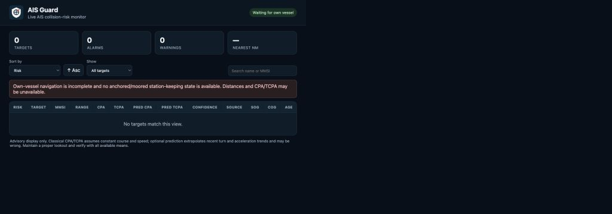

# Signal K AIS Guard

`signalk-ais-guard` is a dependency-free Signal K server plugin for continuous advisory AIS collision-risk assessment. Version 1.6.0 combines analytical CPA/TCPA with an optional **pluggable trajectory-predictor ensemble** governed by the versioned AIS Guard Trajectory Predictor Interface (AGTPI) v1.

Predictors are deliberately separated from risk thresholds: each predictor reports CPA/TCPA/confidence or abstains; AIS Guard applies one common classifier; the final predictive risk is assessed by ordinal majority vote. If the configured predictor quorum is unavailable, analytical CPA/TCPA is used as fallback.

Three transparent predictors ship by default: `constant-velocity`, `constant-turn-rate`, and `adaptive-turn-acceleration`. They are deterministic kinematic models, not trained AI/ML models. Future predictors can register through the documented interface without modifying ensemble/voting code.

AIS Guard remains active while own vessel is anchored or moored by consuming `navigation.anchor.*` and `navigation.state` station-keeping evidence; this permits position-only own-vessel guarding when SOG/COG are unavailable or meaningless at rest.

The companion WebApp lists targets and supports ordering by risk, distance, CPA/TCPA, predicted CPA/TCPA, confidence, name, MMSI, speed, and age. It exposes ensemble vote counts and the API exposes per-predictor reports for auditability. Version 1.6.0 also publishes a Signal K Plotter Extension plus an optional Freeboard-SK ResourceSet showing representative predicted own/target paths and predicted closest-approach encounter points for hazardous targets.

## Documentation

See [Architecture](docs/architecture.md), [Risk Model](docs/risk_model.md), [Predictive Intelligence](docs/predictive_intelligence.md), [AGTPI v1](docs/trajectory_predictor_interface.md), [Configuration](docs/configuration.md), [Anchor-watch integration](docs/anchor_watch_integration.md), [Notifications](docs/notifications.md), [WebApp](docs/webapp.md), [Freeboard-SK Extension](docs/freeboard_extension.md), [Testing](docs/testing.md), [Reproducibility](docs/reproducibility.md), [Research Harness](research/README.md), [Safety](docs/safety.md), and [Publishing](docs/publishing.md).

## Safety

AIS Guard is advisory software. AIS can be incomplete or wrong; model consensus is not independent sensor confirmation; prediction confidence and vote ratios are not collision probability. Maintain proper lookout, use radar/ARPA where available, and comply with applicable collision regulations.

## Research

The `research` directory provides a dependency-free, Signal-K-independent harness for canonical AIS dataset preparation, validation, causal encounter-case construction, leakage-resistant deterministic splitting, AGTPI predictor benchmarking, experiment comparison, and provenance manifests. Run `npm run research:reproduce` to execute the deterministic synthetic reference experiment, then follow `docs/reproducibility.md` for real datasets and publication-grade replication.

## Development

Run `npm ci --ignore-scripts`, `npm run build`, `npm test`, `npm run lint`, `npm audit --audit-level=high`, and `npm pack --dry-run` before release.

Apache-2.0.
