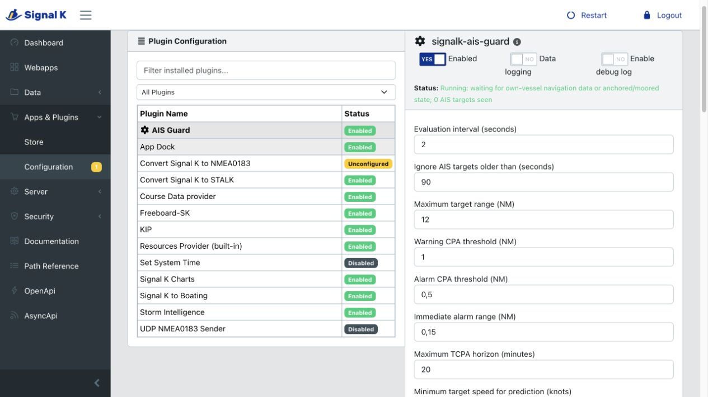

# Getting Started

AIS Guard continuously evaluates AIS contacts relative to own vessel. Classical CPA/TCPA is always available; the optional predictor ensemble is disabled by default.

A useful assessment requires fresh own-vessel and target position, SOG, and true COG. Name and MMSI are identification metadata only. Commission initially with synthetic/replay or known low-risk encounters and confirm converging, opening, stale, immediate-range, and notification-clear behavior.

After validating the analytical path, enable `predictiveAiEnabled`. The default ensemble registers three AGTPI v1 predictors: constant velocity, constant turn rate, and adaptive turn/acceleration. At least `predictionMinimumVotes` eligible reports are required; otherwise the system falls back to analytical CPA/TCPA.

Use the WebApp to inspect vote counts and per-predictor disagreement. Before tuning, read [Risk Model](risk_model.md), [Predictive Intelligence](predictive_intelligence.md), [Trajectory Predictor Interface](trajectory_predictor_interface.md), [Configuration](configuration.md), and [Safety](safety.md).

Open the companion WebApp from the Signal K **Webapps** page. On a default local installation its URL is `http://localhost:3000/signalk-ais-guard/`; use HTTPS only when TLS is configured in front of Signal K.

## Using AIS Guard at anchor or on a mooring

No direct plugin-to-plugin configuration is required. Keep the anchor-watch/state plugin publishing its normal Signal K paths and leave `anchorWatchIntegrationEnabled` and `stationKeepingGuardEnabled` enabled. AIS Guard recognizes `navigation.anchor.state` / `navigation.anchor.position` and `navigation.state=anchored|moored`. The WebApp reports the resulting own-vessel mode.

Verify the integration by setting the anchor watch, confirming AIS Guard reports `anchored` and `anchor watch`, and observing that AIS targets continue to receive range/CPA/TCPA assessments even if COG becomes unavailable at zero speed. Raising the anchor must return the system to ordinary motion-data requirements.
